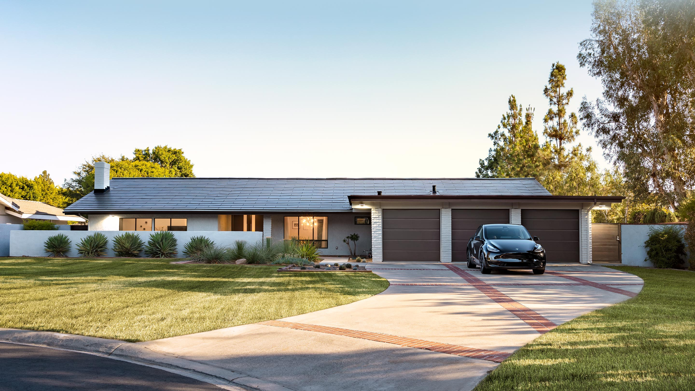

# Tesla Clone

## Website Link => https://bm-tesla-clone.netlify.app/

## => Tesla Clone developed using React.

## Project's Screenshots =>





<h2>Getting Started</h2>

1. To get started with this project, you will need to have `Node.js` and `NPM` installed on your system.

2. First, you need to open a `Terminal` in your system and `Clone` this repository by using :

```bash
git clone https://github.com/Mk4Levi/Tesla-Clone-MK.git
```

3. Navigate to the Project's directory :

```bash
cd Tesla-Clone-MK
```

4. Install all Dependencies used in this Project :

```bash
npm install
```

5. Finally, host it on local server :

```bash
npm run start
```

6. Now just search this link in your browser to view the live running application in your Local sysytem :

```bash
http://localhost:3000
```

<h2>Paths & Files</h2>

### Structure of the Folders & Files in this Repo :

```text
.
├── public/
├── src
│   ├── assets/
│   ├── components/
|         └── Header.js
│         └── Footer.js
|         └── Home.js
│         └── index.js
│
│   ├── config/
|         └── firebaseConfig.js
│         └── index.js
│
│   ├──  css/
|         └── About.css
│         └── App.css
|         └── Contacts
│
│   ├── pages/
|         └── About.js
│         └── Contact.js
|         └── Home.js
|         └── Home2.js
│         └── Projects.js
|         └── index.js
|
│   ├── App.js
│   ├── index.js
│   ├── vercel.json
│
├── .eslintrc.json
├── .gitattributes
├── .gitignore
├── index.html
├── package-lock.json
├── package.json
├── README.md
├── vite.config.js

```

# Thank You
